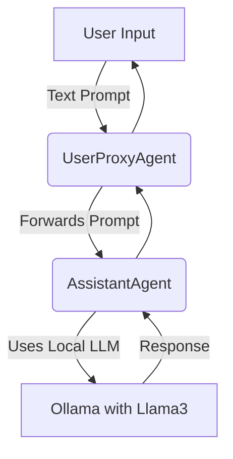

# 🧠 Brainstorm Buddy

**Brainstorm Buddy** is an AI-powered assistant designed to support idea generation, collaborative planning, and creative thinking. Built using Microsoft's AutoGen framework and locally hosted LLMs via Ollama, this project facilitates seamless multi-agent conversations to help users shape and refine their innovative concepts.

## 🚀 Features

* 💬 Interactive idea generation via natural language
* 🧑‍🤝‍🧑 Multi-agent system using UserProxyAgent and AssistantAgent
* 🔗 Powered by local LLMs (e.g., Llama3 via Ollama)
* 🧠 Context-aware suggestions and feedback
* 📦 Lightweight and runs offline using local models

## 🛠️ Tech Stack

* [Python](https://www.python.org/)
* [AutoGen by Microsoft](https://github.com/microsoft/autogen)
* [Ollama](https://ollama.com/)
* [Llama3 (or other local LLMs)](https://ollama.com/library/llama3)
* Terminal / CLI interface (customizable)

## 🧩 Architecture



## ⚙️ How to Run

1. **Install Requirements**

   ```bash
   pip install autogen
   ```

2. **Set Up Ollama**
   Download and install [Ollama](https://ollama.com/) and run:

   ```bash
   ollama run llama3
   ```

3. **Clone and Run the Project**

   ```bash
   git clone https://github.com/Surya-S-17/Brainstrom-buddy-using-Ollama-AutoGen.git
   cd brainstorm-buddy
   python app.py
   ```

## 💡 Use Cases

* Startup or project idea brainstorming
* Creative writing and storytelling
* Academic or research topic discussions
* AI-assisted planning sessions

## 📸 Screenshots


## 🙌 Acknowledgements

* Inspired by Microsoft AutoGen's multi-agent architecture
* Powered by open-source LLMs from Ollama
* Guided by **Dayana Vincent** (during Milan Digital internship)

